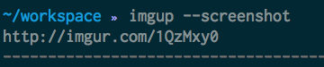

imgup
=====

Upload an image anonymously to imgur

returns a url to the anonymous photo upload

pipe it through `xsel` or `pbcopy` for auto copy to clipboard

`imgup sloth.png | pbcopy`

or you can upload your most recent screenshot anonymously with the `--screenshot` flag

`imgup --screenshot |pbcopy`

As of now this requires `Screen Shot*` as the naming convention _AND_ a 24 hour clock.

Setup
===

1. stack install

2. get a client_id for imgur

3. `echo "CLIENT_ID=<YOUR CLIENT-ID>" > ~/.imgup`
